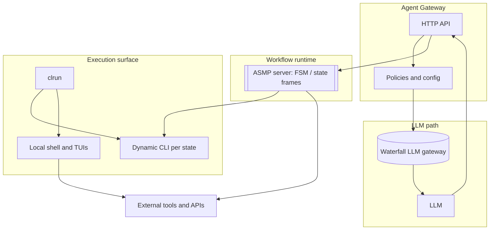
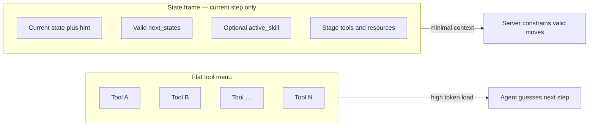
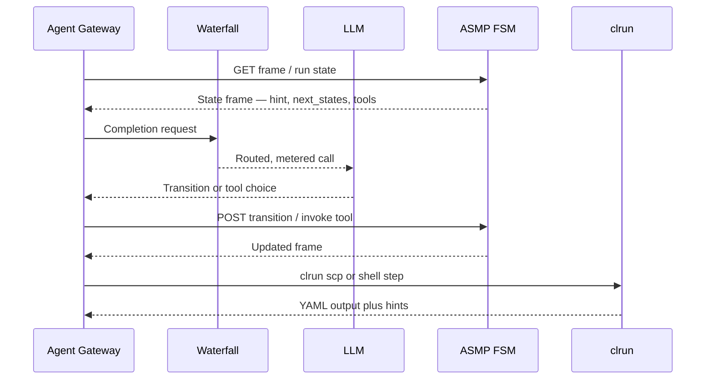
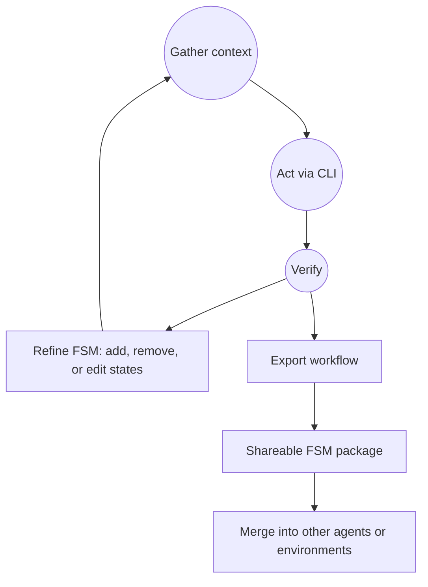

# Haath

**Haath** is an autonomous LLM agent that **executes inside a Finite State Machine**. It uses [**ASMP**](https://github.com/cybertheory/asmp) (**Agent State Machine Protocol**; the same codebase documents the wire protocol as **SCP**, Structured Command Protocol) to define where the agent is in a workflow, what it may do next, and what context matters *right now*. It uses [**clrun**](https://github.com/cybertheory/clrun) to drive those workflows from the terminal: the same agent-native CLI can attach to **remote** ASMP servers or **local** in-process FSMs, run shell commands, and follow the **dynamic CLI** surface that ASMP exposes per state (`GET /runs/{run_id}/cli`).

The central idea: **the model does not “see every tool at once.”** It sees the current **state frame**—hints, valid transitions, optional **active skill**, and stage-scoped tools/resources—then acts through **CLIs and HTTP** that are tied to that state. **Haath can add, remove, and refine states** as new context appears, so behavior improves over time. Workflows and FSM definitions can be **exported, downloaded, and merged**, so learned structure stays **modular** and shareable across agents and deployments.

---

## Diagrams

### Architecture at a glance

How the control plane, model gateway, FSM, and CLI broker connect:

### Progressive disclosure vs a flat tool menu

Haath follows the ASMP idea: **only the current state** is fully expanded in context—not every capability at once.

### Execution loop

One turn through sensing the frame, acting, and advancing the workflow:

### Trainable, modular workflows

The FSM can **change over time**; definitions can be **exported and merged** so knowledge stays portable.

---

## How it fits together

| Layer | Role |
|--------|------|
| **LLM** | Chooses transitions and invocations allowed by the current state; reads compressed per-state context. |
| [**ASMP**](https://github.com/cybertheory/asmp) | Authoritative FSM: state frames, progressive disclosure, optional NDJSON streams, stage tools/resources, optional Open Agent Skill hooks. |
| [**clrun**](https://github.com/cybertheory/clrun) | PTY-backed commands, TUI navigation, structured YAML responses with hints—and `clrun scp <url>` to drive ASMP-backed flows as an interactive CLI. |
| **Haath** | Orchestrates learning and mutation of the FSM, connects gateways and providers, and keeps operational and financial boundaries explicit. |

---

## Design principles

- **Token efficiency** — Only the **current state** (and its `next_states`, tools, resources, and optional **just-in-time** skill) is in play, not a flat menu of every capability. ASMP’s state frame model is built for minimal, deterministic context ([ASMP README](https://github.com/cybertheory/asmp/blob/main/README.md)).

- **CLI first** — External tools and system work surface as **commands and CLIs**. clrun gives persistent sessions, structured YAML (`output`, `hints`, `warnings`), and keystroke-level control for TUIs; it also speaks ASMP’s **dynamic remote CLI** so state transitions feel like a guided terminal ([clrun README](https://github.com/cybertheory/clrun/blob/main/README.md)).

- **Workflow modularity** — Workflows are **graphs of states**, not one giant prompt. They can be versioned, shipped pre-built, **exported**, and **merged** so teams reuse vetted paths and agents contribute deltas without monoliths.

- **Context and skill compression** — Per-state **hints** and optional **active_skill** links keep instructions **scoped to the step**. Skills load when the FSM says they should, not upfront for every task.

- **Extensibility** — New capabilities are added as **states, transitions, handlers, and CLIs**—standard HTTP/JSON on the ASMP side and composable clrun sessions locally—without rewriting the whole agent stack.

- **Turnkey, immediate utility** — Pre-shipped workflows (search, secrets, browser automation, gateway monitoring, etc.) give **day-one** behavior; the agent still **specializes** by evolving the FSM.

- **Financial awareness** — LLM traffic is routed through **[Waterfall](https://waterfall.finance)** as the **LLM gateway**: track usage, align spend with budgets, and keep API-style AI consumption visible to operators and finance ([Gateway](https://waterfall.finance/products/gateway), [platform overview](https://waterfall.finance)).

---

## Components

### The Agent Gateway

A **control plane** for connecting to and **configuring** the agent over an API: identities, policies, which workflows are active, and how the model is called. It is the place to **wire LLM configuration through Waterfall** so calls are **metered, attributed, and automatable** from a spend and operations perspective—not a silent line item on a vendor bill.

### The FSM (via [ASMP](https://github.com/cybertheory/asmp))

The **workflow server** the agent uses to execute work. The FSM acts as a **structured agentic scratchpad**: each **state** holds the knowledge and affordances that matter for that step—**valid next actions**, optional tools/resources, and natural-language **hints** that bridge into the LLM.

- Actions are exposed in ways agents can drive reliably—including **CLI-shaped** flows via ASMP’s dynamic CLI and clrun’s `scp` mode.
- The agent can **dynamically modify** the FSM on the ASMP server as new requirements appear (new branches, states, or refinements), which is what makes Haath **trainable** in the structural sense—not only weight updates, but **workflow evolution**.
- **Pre-shipped workflows** encode important skills: web search, password management, browser automation, **Waterfall / LLM gateway** observability, and more—so new deployments are useful before custom training.

### The CLI Broker ([clrun](https://github.com/cybertheory/clrun))

The **agentic CLI** the agent uses to **run commands**, survive interactive installers, and **attach to ASMP**. clrun provides **basic system operations** (shell, long-running processes, TUI automation) and a **single interaction model** (IDs, tail, key, input) whether the backend is a local PTY or an ASMP **state machine** exposing the CLI endpoint.

---

## Related projects

- [**cybertheory/asmp**](https://github.com/cybertheory/asmp) — Protocol, spec, Python and TypeScript SDKs, examples, and skills.
- [**cybertheory/clrun**](https://github.com/cybertheory/clrun) — Interactive CLI for agents; SCP/ASMP dynamic CLI client.
- [**waterfall.finance**](https://waterfall.finance) — AI usage, spend tracking, and gateway products for payable, observable LLM access.

---

## License

To be set in this repository; upstream [asmp](https://github.com/cybertheory/asmp) and [clrun](https://github.com/cybertheory/clrun) use MIT.
